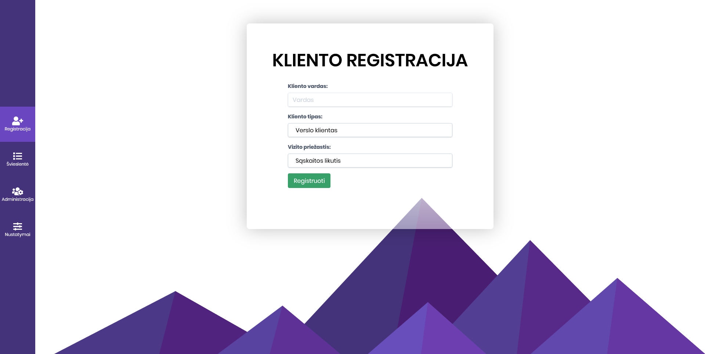
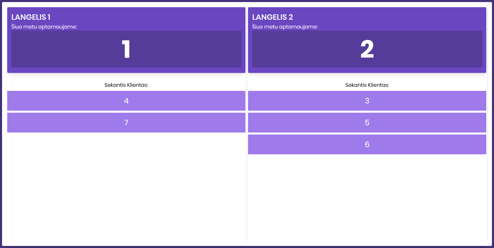
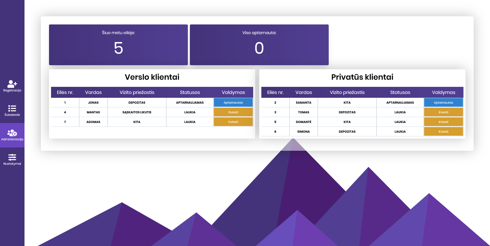

# NFQ 2019 Rudens Stojimo užduotis FRONTEND

Šis projektas imituos priėmimo langelius, kurie yra naudojami ligoninėse, bankuose, paštuose ir t.t.

## Projekto atsisiuntimo instrukcija

Norėdami atsisiųsti šį projektą į savo kompiuterį, jame privalote turėti instaliuotą versijų kontrolės sistemą, kitaip vadinamą git.

[GIT - versijų kontrolės sistema](https://git-scm.com/)

Jei jau esate instaliavęs git, atsidarykite terminal langą kompiuteryje ir nukopijuokite komandą:

 `git clone https://github.com/EvaldasBurlingis/nfq-akademija-frontend-task.git`

 ## Failų sistema
 ```
|- css/
    |- style.css
|- js/
    |- app.js
    |- data.js
|- data/
    |- demo.json
|- index.html 
|- queue.html
|- administrator.html
|- management.html
 ```

## Funkcijos


* [Kliento registracija](https://evaldas-nfq.netlify.com/) - Galimybė užregistruoti naują klientą, kuris bus pridėtas į laukimo eilę. Registracijos metu užpildomi laukeliai: kliento vardas, specialisto pasirinkimas, vizito priežastis. Viską užpildžius ir paspaudus registruoti mygtuką, gaunamas eilės numeris, kuris yra pridedamas į laukiančiųjų eilėje lauką. Kliento registracija ir laukimo sąrašas yra atnaujinami realiu laiku, stebint localStorage pasikeitimus, todėl yra galimybė turėti atidarytus 2 skirtingus tabus(registracija ir laukimo sąrašas) ir jie bus atnaujinti realiu laiku.

---

* [Švieslentė](https://evaldas-nfq.netlify.com/queue.html) - Rodo šiuo metu aptarnaujamą klientą ir klientų laukimo sąrašą. Realiu laiku atnaujinima informacija užregistravus naują klientą arba administravimo puslapyje pakeitus statusą.

---


* [Administracija](https://evaldas-nfq.netlify.com/management.html) - Iš administracijos puslapio yra valdoma visa aplikacija. Jame pateikiamas skaičius klientų, kurie stovi eilėje pas specialistą ir skaičius klientų, kurie buvo aptarnauti. Taip pat yra dvi lentelės su klientais(verslo klientai ir privatūs klientai). Šalia kiekvieno kliento yra mygtukas, kuriuo galima valdyti aplikacijos būsena. Mygtukas turi 3 reikšmes: ***Kviesti, Aptarnautas ir Baigta***

* ***Kviesti*** - Klientas yra kviečiamas pas specialistą, Švieslentės puslapyje kliento eilės nr. pasikeičia į kviečiamo kliento eilės nr ir jis dingta iš laukiančiųjų eilės.
* ***Aptarnautas*** - Klientas buvo aptarnautas ir gali būti panaikintas iš švieslentės pulapio.

---


* [Nustatymai](https://evaldas-nfq.netlify.com/administrator.html)

 ## Projektas sukurtas naudojant

 * [TailwindCSS](https://tailwindcss.com) - CSS Framework
 * [FontAwesome](https://fontawesome.com/) - Ikonos
